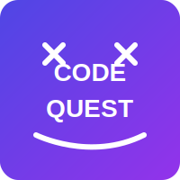

# Code Quest: The Path of the Programmer



## Overview

Code Quest is an interactive, gamified learning platform designed to teach programming concepts through an engaging adventure. Players embark on a journey to become master programmers, learning everything from basic programming concepts to advanced frameworks and languages.

## Features

### 🎮 Immersive Learning Experience

- **Interactive Storyline**: Progress through a narrative that introduces programming concepts in context
- **Multiple Themes**: Choose between Fantasy, Cyberpunk, and Space themes to customize your experience
- **Profile System**: Create and manage multiple profiles to track progress for different users

### 🤖 Adaptive Learning System

- **Personalized Difficulty**: Dynamic challenge levels based on your performance
- **AI Recommendations**: Smart suggestions for what to learn next based on your strengths and weaknesses
- **Spaced Repetition**: Optimized review scheduling to maximize long-term retention

### 💻 Comprehensive Coding Challenges

- **Fundamental Concepts**: Variables, conditionals, loops, functions, and data structures
- **Multiple Languages**: JavaScript, HTML, CSS, Python, and more
- **Frameworks & Libraries**: React, Django, Flask, and Tailwind CSS

### 🚀 Expanded Language Tracks

- **Additional Languages**: Java, Ruby, Go, C#, and Swift
- **Specialized Paths**: Data Science, Mobile Development, and Game Development
- **Advanced Topics**: Design Patterns, Algorithms, and System Architecture

### 🏆 Progress Tracking

- **Skill Leveling**: Gain experience and level up as you complete challenges
- **Auto-Save**: Never lose your progress with automatic saving
- **Achievement System**: Earn achievements for completing quests and mastering skills

## Technologies Used

- **Frontend**: React, Tailwind CSS
- **State Management**: React Hooks (useState, useEffect, useCallback)
- **Storage**: Browser localStorage for saving progress
- **Build Tool**: Vite

## Getting Started

### Prerequisites

- Node.js (v14 or higher)
- npm or yarn

### Installation

1. Clone the repository

   ```bash
   git clone https://github.com/yourusername/code-quest.git
   cd code-quest
   ```

2. Install dependencies

   ```bash
   npm install
   # or
   yarn install
   ```

3. Start the development server

   ```bash
   npm run dev
   # or
   yarn dev
   ```

4. Open your browser and navigate to `http://localhost:5174`

## Usage

1. **Create a Profile**: Start by creating a new profile with your name
2. **Choose a Theme**: Select your preferred visual theme (Fantasy, Cyberpunk, or Space)
3. **Begin Your Journey**: Follow the storyline and complete coding challenges
4. **Track Your Progress**: View your skills, completed quests, and achievements in the profile screen

## Code Structure

- `src/EnhancedCodeQuest.jsx`: Main application component with game logic and UI
- `src/CodePlayground.jsx`: Interactive code editor for challenges
- `src/CodeQuestPlaygroundIntegration.jsx`: Integration between game and code editor
- `src/challengesData.js`: Database of coding challenges

## Future Enhancements

- Cloud synchronization for progress across devices
- Multiplayer challenges and competitions
- Additional programming languages and frameworks
- Mobile application support
- Expanded storyline with branching paths

## Contributing

Contributions are welcome! Please feel free to submit a Pull Request.

1. Fork the repository
2. Create your feature branch (`git checkout -b feature/amazing-feature`)
3. Commit your changes (`git commit -m 'Add some amazing feature'`)
4. Push to the branch (`git push origin feature/amazing-feature`)
5. Open a Pull Request

## License

This project is licensed under the MIT License - see the LICENSE file for details.

## Acknowledgments

- Thanks to all the open-source libraries that made this project possible
- Inspired by the gamification of learning platforms like Codecademy and freeCodeCamp

---

Designed and developed with ❤️ by Elisee Kajingu
